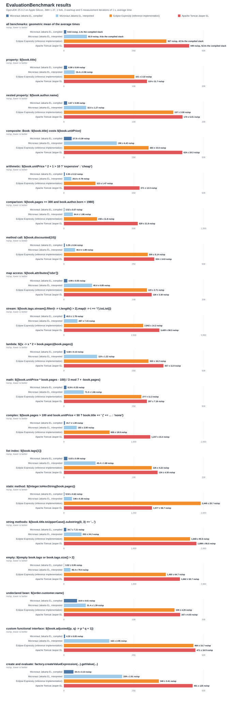

# Benchmarks

JMH microbenchmarks of the evaluation of Jakarta Expression Language expressions, comparing:

- `compiled` — Micronaut Jakarta EL, the expressions compiled by the annotation processor;
- `interpreted` — Micronaut Jakarta EL, the same expressions parsed at runtime by `micronaut-jakarta-el-interpreter`;
- `expressly` — [Eclipse Expressly](https://github.com/eclipse-ee4j/expressly), the reference implementation of the specification;
- `tomcat` — [Apache Tomcat Jasper EL](https://tomcat.apache.org/).

`EvaluationBenchmark` evaluates a `jakarta.el.ValueExpression` created once, against a context holding the
`book` bean under its name with the default resolvers of each implementation. `createAndEvaluate` creates the
expression from its string on every invocation: a registry lookup for the compiled stack, a parse or a parse
cache lookup for the others.

## Running

```bash
./gradlew :micronaut-benchmarks:jmh
```

Overrides: `-Pjmh.includes=<regex>`, `-Pjmh.forks=N`, `-Pjmh.warmupIterations=N`, `-Pjmh.iterations=N`,
`-Pjmh.param.stack=compiled,expressly`, `-Pjmh.profilers=async:...`, `-Pjmh.jvmArgs=...`. The results are
written to `build/results/jmh/results.json`; the chart is rendered from them:

```bash
python3 benchmarks/chart.py benchmarks/build/results/jmh/results.json benchmarks/evaluation-benchmark-results.svg "subtitle"
cp benchmarks/evaluation-benchmark-results.svg src/main/docs/resources/img/
```

When refreshing the results, regenerate the table below, the table of `src/main/docs/guide/whyCompiled.adoc` (and its summary paragraph, updated by hand) and
both copies of the chart with `benchmarks/refresh.sh "<environment and settings>"`.

## Latest local results

<!-- results:start -->
OpenJDK 25.0.2 on Apple Silicon, JMH 1.37, 1 fork, 3 warmup and 5 measurement iterations of 1 s, average time.

| Benchmark | Stack | Score |
| --- | --- | ---: |
| `property` | Micronaut compiled | 4.737 ± 0.134 ns/op |
| `property` | Micronaut interpreted | 22.632 ± 1.411 ns/op |
| `property` | Eclipse Expressly | 104.628 ± 9.760 ns/op |
| `property` | Tomcat Jasper EL | 121.356 ± 8.336 ns/op |
| `nestedProperty` | Micronaut compiled | 5.027 ± 0.412 ns/op |
| `nestedProperty` | Micronaut interpreted | 45.882 ± 5.355 ns/op |
| `nestedProperty` | Eclipse Expressly | 164.903 ± 7.792 ns/op |
| `nestedProperty` | Tomcat Jasper EL | 175.744 ± 11.321 ns/op |
| `composite` | Micronaut compiled | 29.921 ± 3.229 ns/op |
| `composite` | Micronaut interpreted | 205.198 ± 17.931 ns/op |
| `composite` | Eclipse Expressly | 313.010 ± 17.840 ns/op |
| `composite` | Tomcat Jasper EL | 452.548 ± 24.220 ns/op |
| `arithmetic` | Micronaut compiled | 3.515 ± 0.279 ns/op |
| `arithmetic` | Micronaut interpreted | 31.538 ± 2.334 ns/op |
| `arithmetic` | Eclipse Expressly | 123.183 ± 11.465 ns/op |
| `arithmetic` | Tomcat Jasper EL | 279.232 ± 20.299 ns/op |
| `comparison` | Micronaut compiled | 3.678 ± 0.253 ns/op |
| `comparison` | Micronaut interpreted | 92.729 ± 8.382 ns/op |
| `comparison` | Eclipse Expressly | 251.490 ± 52.817 ns/op |
| `comparison` | Tomcat Jasper EL | 562.769 ± 66.391 ns/op |
| `methodCall` | Micronaut compiled | 4.916 ± 0.293 ns/op |
| `methodCall` | Micronaut interpreted | 58.094 ± 6.790 ns/op |
| `methodCall` | Eclipse Expressly | 316.834 ± 27.455 ns/op |
| `methodCall` | Tomcat Jasper EL | 337.341 ± 46.856 ns/op |
| `mapAccess` | Micronaut compiled | 5.289 ± 0.403 ns/op |
| `mapAccess` | Micronaut interpreted | 54.308 ± 2.992 ns/op |
| `mapAccess` | Eclipse Expressly | 126.326 ± 11.615 ns/op |
| `mapAccess` | Tomcat Jasper EL | 137.667 ± 11.680 ns/op |
| `stream` | Micronaut compiled | 46.986 ± 6.319 ns/op |
| `stream` | Micronaut interpreted | 543.862 ± 44.141 ns/op |
| `stream` | Eclipse Expressly | 2988.997 ± 226.383 ns/op |
| `stream` | Tomcat Jasper EL | 3665.147 ± 215.141 ns/op |
| `lambda` | Micronaut compiled | 5.847 ± 0.410 ns/op |
| `lambda` | Micronaut interpreted | 138.129 ± 9.632 ns/op |
| `lambda` | Eclipse Expressly | 320.178 ± 31.297 ns/op |
| `lambda` | Tomcat Jasper EL | 369.119 ± 25.595 ns/op |
| `math` | Micronaut compiled | 10.547 ± 0.963 ns/op |
| `math` | Micronaut interpreted | 85.398 ± 5.873 ns/op |
| `math` | Eclipse Expressly | 289.316 ± 10.727 ns/op |
| `math` | Tomcat Jasper EL | 312.010 ± 17.132 ns/op |
| `complex` | Micronaut compiled | 17.267 ± 3.177 ns/op |
| `complex` | Micronaut interpreted | 250.831 ± 14.595 ns/op |
| `complex` | Eclipse Expressly | 706.562 ± 31.501 ns/op |
| `complex` | Tomcat Jasper EL | 1310.032 ± 97.640 ns/op |
| `listIndex` | Micronaut compiled | 5.424 ± 1.754 ns/op |
| `listIndex` | Micronaut interpreted | 56.436 ± 3.691 ns/op |
| `listIndex` | Eclipse Expressly | 130.768 ± 15.020 ns/op |
| `listIndex` | Tomcat Jasper EL | 141.939 ± 6.381 ns/op |
| `staticMethod` | Micronaut compiled | 10.138 ± 0.437 ns/op |
| `staticMethod` | Micronaut interpreted | 138.961 ± 5.990 ns/op |
| `staticMethod` | Eclipse Expressly | 2607.085 ± 227.502 ns/op |
| `staticMethod` | Tomcat Jasper EL | 1662.849 ± 101.171 ns/op |
| `stringMethods` | Micronaut compiled | 37.710 ± 4.485 ns/op |
| `stringMethods` | Micronaut interpreted | 262.027 ± 55.545 ns/op |
| `stringMethods` | Eclipse Expressly | 1925.276 ± 188.723 ns/op |
| `stringMethods` | Tomcat Jasper EL | 1949.831 ± 187.366 ns/op |
| `emptyCheck` | Micronaut compiled | 3.705 ± 0.252 ns/op |
| `emptyCheck` | Micronaut interpreted | 100.416 ± 45.646 ns/op |
| `emptyCheck` | Eclipse Expressly | 1571.693 ± 155.320 ns/op |
| `emptyCheck` | Tomcat Jasper EL | 1824.400 ± 182.381 ns/op |
| `dynamicBean` | Micronaut compiled | 21.807 ± 2.390 ns/op |
| `dynamicBean` | Micronaut interpreted | 46.087 ± 4.810 ns/op |
| `dynamicBean` | Eclipse Expressly | 165.836 ± 16.262 ns/op |
| `dynamicBean` | Tomcat Jasper EL | 178.084 ± 8.612 ns/op |
| `customLambda` | Micronaut compiled | 3.417 ± 0.255 ns/op |
| `customLambda` | Micronaut interpreted | 180.888 ± 12.883 ns/op |
| `customLambda` | Eclipse Expressly | 480.383 ± 117.042 ns/op |
| `customLambda` | Tomcat Jasper EL | 482.508 ± 44.634 ns/op |
| `createAndEvaluate` | Micronaut compiled | 36.184 ± 5.605 ns/op |
| `createAndEvaluate` | Micronaut interpreted | 212.643 ± 19.588 ns/op |
| `createAndEvaluate` | Eclipse Expressly | 361.488 ± 24.833 ns/op |
| `createAndEvaluate` | Tomcat Jasper EL | 491.169 ± 191.138 ns/op |

Aggregate, the geometric mean of the average times over all the benchmarks:

| Stack | Geometric mean | Relative to compiled |
| --- | ---: | ---: |
| Micronaut compiled | 9.26 ns/op | 1.0x |
| Micronaut interpreted | 100.81 ns/op | 10.9x |
| Eclipse Expressly | 387.56 ns/op | 41.9x |
| Tomcat Jasper EL | 472.54 ns/op | 51.1x |


<!-- results:end -->
